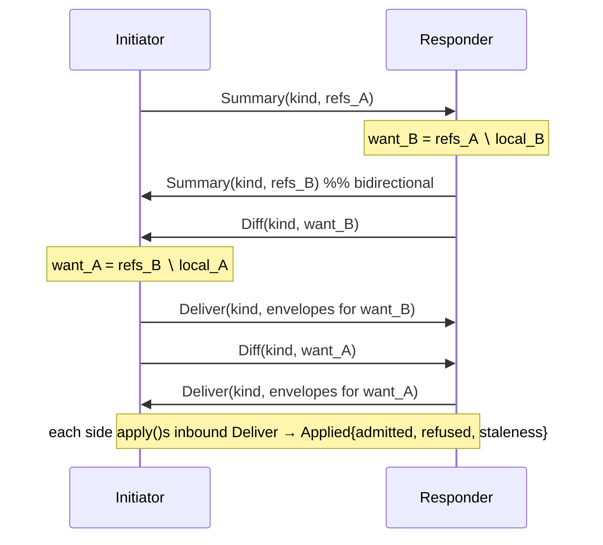
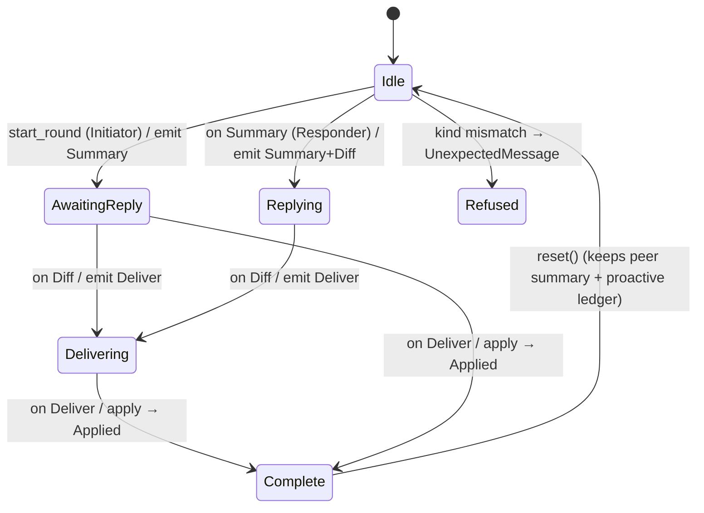
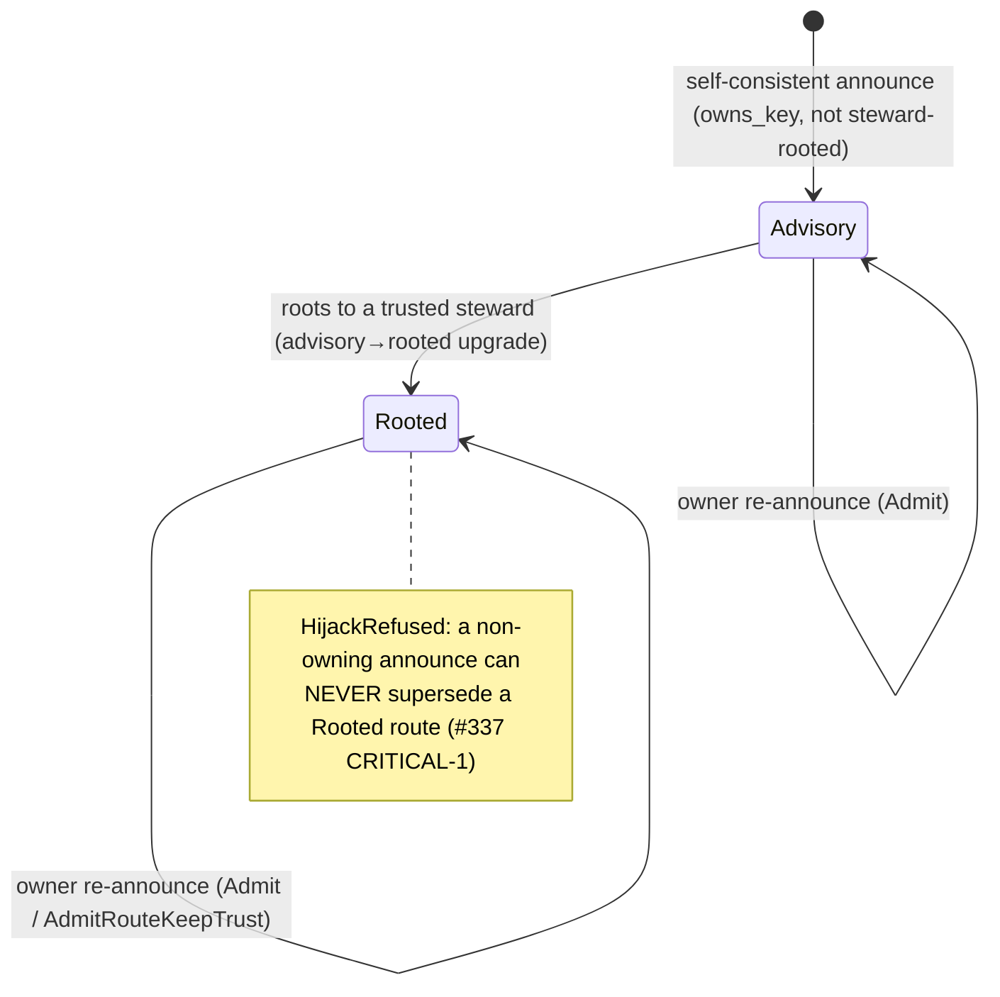

# CIRISEdge — Transport & Replication Protocol

> **What this is.** `ciris-edge` is the transport and replication layer of the
> CIRIS Epistemic Web ([CEWP](https://ciris.ai/cewp)). It moves the 14 signed
> envelope kinds of the CEG grammar between federation peers over any medium
> (Reticulum mesh, HTTPS, packet radio), decides *who is allowed to learn a
> claim exists*, and attributes every inbound byte to a cryptographic identity
> **before any handler sees it**. It is the operational realization of
> **[Constitution Part 5 — Transport & Substrate](../../CIRISConstitution/constitution/part_5_transport_substrate.md)**.
>
> Two disciplines run through every rule below, taken verbatim from Part 5:
> - **Non-maleficence / fail-secure** — a missing key, an unreachable peer, an
>   unresolved consent view all resolve to *less* access and an honest miss,
>   never a silent downgrade or a fabricated success.
> - **Integrity through structure** — privacy and authenticity are properties
>   the wire format *cannot violate*, not promises an operator makes.
>
> The thesis, from [ciris.ai/contextual-integrity](https://ciris.ai/contextual-integrity/):
> **"the strongest flow rule is one the network cannot express breaking."** Every
> gate in this document is built so that the inappropriate flow is unrepresentable,
> not merely disallowed.

---

## 1. Where edge sits — CEG vs OSI

CEG is not an OSI clone. It has the familiar layers, but three properties are
**woven through** them that OSI never models: **identity *is* addressing**,
**consent *is* routing**, and **integrity through structure**. Edge occupies OSI
layers 4–6 and is where those three properties are *enforced on the wire*.

| OSI | CEG / CIRIS realization | Owned by |
|---|---|---|
| 7 Application | The CEG grammar — semantic claims: the 14 `EnvelopeKind`s, attestations, dimensions | persist / verify (grammar); edge transports it |
| 6 Presentation | Wire codec (CRPL framing, JCS canonicalization, `Signed*` wrappers) + **hybrid crypto** (Ed25519 + ML-DSA-65) | edge (framing) / verify (crypto) |
| 5 Session | **Anti-entropy replication session** — Summary → Diff → Deliver, per `(peer, kind)` | **edge** (§4) |
| 4 Transport | Authenticated, encrypted links + the `Transport` trait; **source attribution at ingest** | **edge** (§5) |
| 1–3 Physical/Link/Network | TCP/IP, LoRa, serial, I²P — addressing + routing | Reticulum / Leviculum |

**The three orthogonal properties (no OSI analogue):**

| Property | What it means | Where enforced |
|---|---|---|
| **Identity = addressing** | A peer's transport address *is* a projection of its federation key; there is no separate naming layer to spoof. | `#393` attribution (§5) — a frame is attributed iff its link proved `Rooted ∧ owns_key`. |
| **Consent = routing** | *Who* may receive a flow is bounded by the transmission principle (the consent grant), not merely by reachability. | The Attestation serve gates (§6). |
| **Integrity through structure** | `self`/`family` content emits **no directory advertisement** — the network cannot learn it exists. | Structural invisibility (Part 5 §5.2); the `SelfOwn` projection (§3). |

---

## 2. The 14 EnvelopeKinds

Every load-bearing claim is a signed wire artifact. Edge replicates exactly 14
kinds — the `EnvelopeKind` enum ([`protocol.rs:81`](../src/replication/protocol.rs)),
1:1 with persist's `put_*` admission surface. Each kind is its own anti-entropy
stream, so a partition on one kind never gates convergence on another.

| # | Kind | Purpose | persist admit | Wire | Flags |
|---|---|---|---|---|---|
| 1 | `Key` | Public key registrations | `put_public_key` | v1 | **bootstrap** |
| 2 | `Attestation` | Trust grants / scores / withdraws / `delegates_to` | `put_attestation` | v1 | **consentable** |
| 3 | `Revocation` | Key-level revocations (R1/Q1 quorum-merge) | `put_revocation` | v1 | tombstone |
| 4 | `IdentityOccurrence` | Agent/human/partner occurrence records | `put_identity_occurrence` | v1 | **bootstrap** |
| 5 | `Family` | Family roster declarations | `put_family` | v1 | |
| 6 | `Community` | Community roster declarations | `put_community` | v1 | |
| 7 | `IdentityOccurrenceRevocation` | Forward-secrecy tombstone | `put_identity_occurrence_revocation` | v1 | tombstone |
| 8 | `FamilyMembershipRevocation` | Forward-secrecy tombstone | `put_family_membership_revocation` | v1 | tombstone |
| 9 | `CommunityMembershipRevocation` | Forward-secrecy tombstone | `put_community_membership_revocation` | v1 | tombstone |
| 10 | `LocationProof` | H3 rough-only geo claim (resolution ≤ 7) | `put_location_proof` | v1 | |
| 11 | `Organization` | Public org identity row | `put_organization` | v2 | |
| 12 | `OrgMembership` | Authz binding (user/org/role) | `put_org_membership` | v2 | |
| 13 | `PartnerRecord` | License+Partner, M-of-N steward quorum | `put_partner_record` | v2 | |
| 14 | `TransportDestination` | Reachability address (hybrid-signed) | `put_signed_transport_destination` | v2 | **bootstrap** |

- **`consentable`** = **only `Attestation`.** It is the sole kind whose flow to a
  recipient is gated by a consent grant (§6). Every other kind is a *structural
  plane* that replicates by policy, never by end-user consent
  ([`resolved_state.rs:36`](../src/replication/resolved_state.rs)).
- **`bootstrap`** = exactly `{Key, IdentityOccurrence, TransportDestination}`
  ([`protocol.rs:203`](../src/replication/protocol.rs)) — the self-authenticating
  kinds a fresh peer must deliver to introduce itself, exempt from the attribution
  gate (§5.4). A test asserts this set is *exactly* those three over all 14 kinds.
- Kinds 1–10 ride wire version `0x01`; the 4 operational kinds require `0x02`.

---

## 3. The namespace — cohort tiers & projections

### 3.1 The seven cohort scopes

Every claim carries a `cohort_scope` — Nissenbaum's *recipient* parameter,
narrowest to widest ([persist `types.rs` `cohort_scope`](../../CIRISPersist/src/federation/types.rs)):

`self` 🪞 → `family` 🏡 → `community` 🏘️ → `affiliations` 🤝 → `species` 🧬 → `biosphere` 🌍 → `federation` 🌐

### 3.2 The projection taxonomy

A `cohort_scope` (plus authority + whether the claim is a tombstone) resolves to
one of three **projections** — the rule for *who advertises and receives* it
(persist `namespace::projection_for`, consumed at
[`bridge.rs:728`](../src/replication/bridge.rs)):

| Projection | Meaning | Who advertises |
|---|---|---|
| **`SelfOwn`** | Publish-your-own (KERI shape) — the structurally-invisible identity plane | Only the subject node (`attesting_key_id ∈ self_set`) |
| **`Cohort`** | Hold-and-forward over a `community`/`affiliations` roster | The anti-entropy cohort |
| **`Global`** | Commons + tombstone gossip reaching the whole federation | Own ∪ cohort (widest enumerable, so tombstones are never out-run) |

**Resolution rule** (`projection_for`):

```
is_tombstone (withdraw / recant / supersede)        → Global   # anti-rollback, overrides all
self | family                                        → SelfOwn  # structural invisibility
community | affiliations                             → Cohort
species | biosphere | federation                     → Global iff authority.is_trust_root(), else Cohort
unrecognized scope                                   → Cohort   # conservative negative default
```

> **Structural invisibility (Part 5 §5.2, normative).** A `self`/`family` claim
> projects `SelfOwn` and emits **no `holds_bytes:sha256:*` directory attestation** —
> "outsiders cannot route to it, read it, or even learn that it exists." This is
> the *unconditional* privacy promise; at-rest encryption is defense-in-depth on
> top, never a substitute.

---

## 4. The anti-entropy replication session (OSI 5)

Replication is **per `(peer, kind)`**, bidirectional, and eventually consistent.
Each round both sides advertise what they hold, request what they lack, and
deliver it. The state machine is **message-typed, not phase-gated** — a session
reacts to the *type* of the inbound message
([`session.rs`](../src/replication/session.rs)).

### 4.1 Roles & messages

- **`SessionRole`**: `Initiator` (emits the first `Summary`; the only role for
  which `start_round` is valid) · `Responder` (reacts to an inbound `Summary`).
- **Messages** (`ReplicationMessage`, `#[serde(tag="type")]`,
  [`protocol.rs:356`](../src/replication/protocol.rs)):

| Message | Fields | Meaning |
|---|---|---|
| `Summary` | `kind`, `refs: [(envelope_hash, seq)]` | "Here are the hashes I hold for `kind`." |
| `Diff` | `kind`, `want: [envelope_hash]` | "I want these — you have them, I don't." |
| `Fetch` | `kind`, `want: [envelope_hash]` | Explicit on-demand fetch (hashes learned out-of-band). |
| `Deliver` | `kind`, `envelopes: [signed_bytes]` | The requested signed envelopes. |

### 4.2 The round



### 4.3 State transitions



| Inbound | Handler | Emits | Notes |
|---|---|---|---|
| *(none, Initiator)* | `start_round` | `Summary` (+ proactive `Deliver` per #380/#927) | Only valid for `Initiator` |
| `Summary` | `on_summary` | `Summary` (Responder) + `Diff` | Records remote summary; `want = local ∖ remote` |
| `Diff` / `Fetch` | `on_diff` / `on_fetch` | `Deliver` | Fetch each wanted hash from the provider |
| `Deliver` | `on_deliver` | *(applies)* → `Applied{admitted, refused, staleness}` | Sets `completed`; tallies admits/refusals |
| *wrong kind* | any | — | `UnexpectedMessage` → `DriveStep::Refused` |

The coordinator maps each `ReplicationOutcome` to a **`DriveStep`**
([`coordinator.rs`](../src/replication/coordinator.rs)): `SendThenWait` · `SendThenComplete`
(initiator-final, #380) · `Complete(RoundReport)` · `Refused`. The responder drain
is bounded (`RESPONDER_REPLY_SEND_TIMEOUT`, #373); assembly latency is O(1) in
consent reads via a per-round memo (#400).

---

## 5. Transport attribution (OSI 4) — identity *is* addressing

Every inbound CRPL frame is attributed to a federation `key_id` **at ingest**,
before any serve gate is consulted. Attribution is a private, unforgeable newtype
[`SourceKeyId`](../src/transport/mod.rs) constructible only by vetted paths.

### 5.1 The `SourceKeyId` constructors

| Constructor | Yields `Some` iff | Used by |
|---|---|---|
| `from_rooted_binding(key_id, provenance, owns_key)` | `provenance == Rooted ∧ owns_key` | Reticulum (the E3 trust gate) |
| `transport_authenticated(key_id)` | always — the *channel* vouches | HTTPS mTLS/bearer, packet radio, FFI, the §5.4 carve-out |

### 5.2 The two-item gate (`#393`, Reticulum)

Both items must pass or `source_key_id = None`:

- **Item 1 — `Rooted ∧ owns_key`.** The link's proven transport identity matches a
  `RootedPeer` that (a) roots to a trusted steward (`provenance == Rooted`) and
  (b) *proved control* of the federation key (`owns_key`).
- **Item 2 — `hybrid_transport_binding_exists`.** A stored, **ML-DSA-signed**
  `SignedTransportDestination` must bind that transport identity (the PQ half of
  attribution). Fail-closed with no rooting directory.

An unattributed frame (`None`) is **`#317 SkippedNoSourceKeyId`** — delivered, then
dropped *before* `peer_has_serve_capability` is ever reached. Defense in depth: the
serve gate is never even asked about a peer the transport couldn't attribute.

### 5.3 Binding provenance & route supersession

A peer binding lives in one of two provenance states, updated by received
announces under `route_supersession_decision` (a pure, exhaustively-tested fn):



| Verdict | When | Effect |
|---|---|---|
| `Admit` | fresh peer / newer epoch / advisory→rooted upgrade / same-owner rooted reroute | Write incoming route **and** trust |
| `AdmitRouteKeepTrust` (**#404**) | owner re-announces **Advisory** over a **Rooted** binding (new dest/epoch) | Heal the route, **preserve** `Rooted ∧ owns_key` — a churn blip must not de-attribute a rooted peer |
| `IgnoreStale` | same/lower epoch, no upgrade or reroute | Cached binding stands |
| `HijackRefused` (**#337**) | announce that **cannot prove ownership** over a Rooted route | Refused *first*, epoch-independent — the anti-spoof invariant |

### 5.4 The bootstrap carve-out (`#402`)

A fresh peer is `UnknownKeyId` until its `Key` is admitted — but that `Key` frame is
exactly what admits it. To break the deadlock, an *un-attributed* CRPL frame whose
kind `is_bootstrap` (`{Key, IdentityOccurrence, TransportDestination}`) is routed on
the link's transport identity (`transport_authenticated`) instead of dropping.
**Safe by construction:** these kinds self-authenticate at persist admission
(`signer_acts_for`), grant no trust, and are served no `trace:*` — the trace-serve
gate stays strictly `Rooted ∧ owns_key`. Every non-bootstrap unattributed frame
still drops (`#317`). A proptest over all 14 kinds proves the carve-out admits
*exactly* the three.

---

## 6. Serve & consent — consent *is* routing (Attestation plane only)

Only the `Attestation` plane is recipient-gated; every other kind serves per its
projection (§3). Three gates compose, narrowest question last
([`bridge.rs`](../src/replication/bridge.rs)):

| Gate | Question | Mechanism |
|---|---|---|
| **`#396` item 1 — consent membership** | May *any* consentable claim flow to this peer? | `list_consent_peers(local)` → `ResolvedPeerSet`; a `ResolvedRecipient` exists **iff** consent includes the peer. Fail-closed → no advertise, no fetch. |
| **`#379` `infra:serve`** | May a `trace:*` attestation be served at all? | `peer_has_serve_capability` = accord-conferred `infra:serve` (`has_effective_role`) **AND** roots to a root *this node* trusts (`capability_roots_to_trusted_root`). |
| **`#396` item 6 — `recipient_capability`** | Which serve-eligible peer still gets *this* row? | The row owner's live consent grant may attach `recipient_capability` restrictions covering the row's `dimension`; the recipient must hold each. |

By construction, the fan-out recipient axis can never exceed the consent grant: a
`ResolvedRecipient` is the only key the serve path accepts, and it is unforgeable
without a `list_consent_peers` hit. This is the wire-level expression of Nissenbaum's
"the recipient must not exceed the transmission principle."

---

## 7. Transports (one interface, many media)

Edge is transport-agnostic: every medium implements `Transport` (`send` +
`listen(sink)`) and produces an `InboundFrame` that carries `source_key_id`
(+ the raw `link_key_id` routing hint).

| Transport | Feature | Attribution source | Status |
|---|---|---|---|
| **Reticulum** (canonical) | `transport-reticulum` (+ per-interface: tcp/udp/rnode/i2p/…) | Full `#393` two-item gate + `link_key_id` | Production |
| **HTTPS** | `transport-http` | `transport_authenticated` (bearer / mTLS) | Production fallback |
| **Packet radio** | `transport-packet-radio` | `None` (attribution not yet wired) | Experimental |

`TransportId`: `HTTP` · `RETICULUM_RS` · `LEVICULUM` · `LORA` · `SERIAL` · `I2P`.
A frame is routed as replication only if it carries the CRPL magic **and** an
attribution (or a §5.4 bootstrap carve-out); otherwise it falls through to envelope
dispatch or drops.

---

## 8. Contextual integrity, on the wire

The [five Nissenbaum parameters](https://ciris.ai/contextual-integrity/) are wire
fields, and edge enforces each as a routing property:

| CI parameter | Wire field | Enforced by |
|---|---|---|
| Data subject | `subject_key_ids` | Wire-level revocation authority |
| Sender | `attesting_key_id` | Every claim signed; attributed at ingest (§5) |
| Recipient | `cohort_scope` / `subject_key_ids` | Projection (§3) + serve gates (§6) |
| Information type | `dimension` | Per-record projection + `recipient_capability` |
| Transmission principle | `consent:*` grant | Consent-membership fan-out (§6, item 1) |

Every gate above is designed so the inappropriate flow is **unrepresentable** — the
type system (`SourceKeyId`, `ResolvedRecipient`) and the projection rules make
"serve a claim past its consent" a compile-or-admission error, not a runtime check
an operator can skip. That is the whole of the design: *the strongest flow rule is
one the network cannot express breaking.*

---

## 9. Invariants (the short list that must never regress)

1. **Fail-secure** — unresolved consent / missing key / unattributable link ⇒ *less*
   access, never a downgrade or a fabricated success.
2. **Structural invisibility** — `self`/`family` emits no directory advertisement.
3. **Attribution before serve** — an unattributed frame never reaches a serve gate.
4. **`Rooted ∧ owns_key` is the sole trace-serve attributor** — the bootstrap
   carve-out (§5.4) never carves out `Attestation`; `#337` hijack refusal is checked
   first.
5. **Consent narrows, never widens** — the fan-out recipient set ⊆ `list_consent_peers`.
6. **Tombstones win** — every revocation projects `Global` (anti-rollback).
7. **PQC-mandatory** — hybrid Ed25519 + ML-DSA-65 for authenticity; item-2 requires
   the ML-DSA transport binding.

---

*Grounded in [Constitution Part 5](../../CIRISConstitution/constitution/part_5_transport_substrate.md),
[Part 2 (grammar)](../../CIRISConstitution/constitution/part_2_the_grammar.md),
[Part 3 (namespace)](../../CIRISConstitution/constitution/part_3_the_namespace.md), and the
code as of edge v14.3.0. Section anchors cite `src/…:line` for navigation.*
