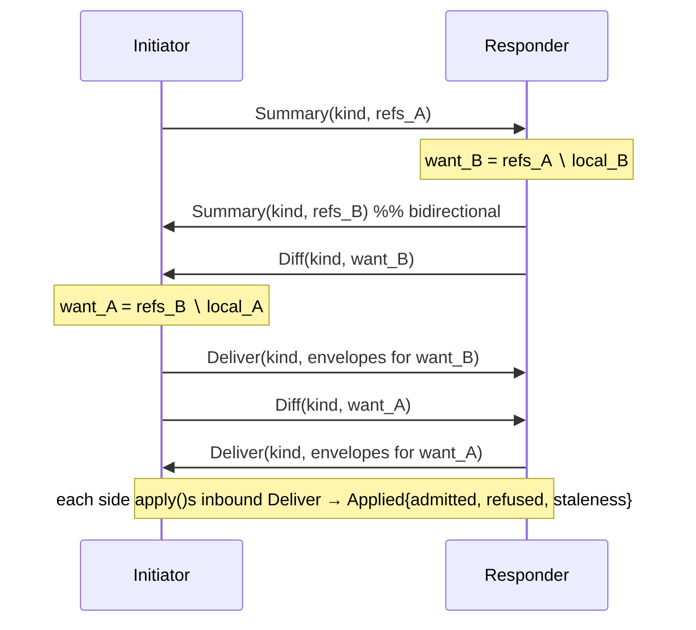
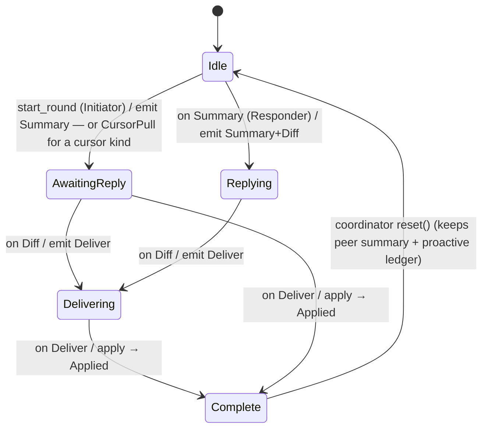
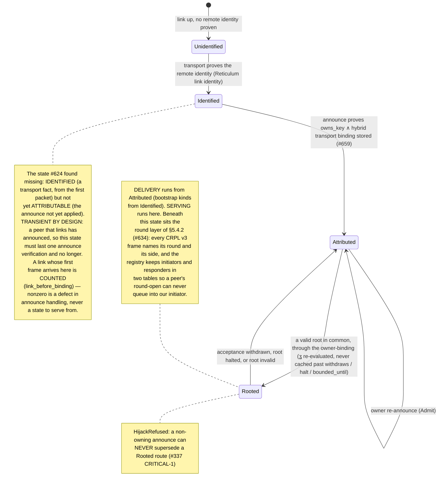

# CIRISEdge — Transport & Replication Protocol

> **What this is.** `ciris-edge` is the transport and replication layer of the
> CIRIS Epistemic Web ([CEWP](https://ciris.ai/cewp)). It moves the 15 signed
> envelope kinds of the CEG grammar between federation peers over any medium
> (Reticulum mesh, HTTPS, packet radio), decides *who is allowed to learn a
> claim exists*, and attributes every inbound byte to a cryptographic identity
> **before any handler sees it**. It is the operational realization of
> **[Constitution Part 5 — Transport & Substrate](../../CIRISConstitution/constitution/part_5_transport_substrate.md)**.
>
> Two disciplines run through every rule below, taken verbatim from Part 5:
> - **Non-maleficence / fail-secure** — a missing key, an unreachable peer, an
>   unresolved consent view all resolve to *less* access and an honest miss,
>   never a silent downgrade or a fabricated success.
> - **Integrity through structure** — privacy and authenticity are properties
>   the wire format *cannot violate*, not promises an operator makes.
>
> The thesis, from [ciris.ai/contextual-integrity](https://ciris.ai/contextual-integrity/):
> **"the strongest flow rule is one the network cannot express breaking."** Every
> gate in this document is built so that the inappropriate flow is unrepresentable,
> not merely disallowed.

---

## 1. Where edge sits — CEG vs OSI

CEG is not an OSI clone. It has the familiar layers, but three properties are
**woven through** them that OSI never models: **identity *is* addressing**,
**consent *is* routing**, and **integrity through structure**. Edge occupies OSI
layers 4–6 and is where those three properties are *enforced on the wire*.

| OSI | CEG / CIRIS realization | Owned by |
|---|---|---|
| 7 Application | The CEG grammar — semantic claims: the 15 `EnvelopeKind`s, attestations, dimensions | persist / verify (grammar); edge transports it |
| 6 Presentation | Wire codec (CRPL framing, JCS canonicalization, `Signed*` wrappers) + **hybrid crypto** (Ed25519 + ML-DSA-65) | edge (framing) / verify (crypto) |
| 5 Session | **Anti-entropy replication session** — Summary → Diff → Deliver, per `(peer, kind)` | **edge** (§4) |
| 4 Transport | Authenticated, encrypted links + the `Transport` trait; **source attribution at ingest** | **edge** (§5) |
| 1–3 Physical/Link/Network | TCP/IP, LoRa, serial, I²P — addressing + routing | Reticulum / Leviculum |

**The three orthogonal properties (no OSI analogue):**

| Property | What it means | Where enforced |
|---|---|---|
| **Identity = addressing** | A peer's transport address *is* a projection of its federation key; there is no separate naming layer to spoof. | `#393` attribution (§5) — a frame is attributed iff its link proved `Rooted ∧ owns_key`. |
| **Consent = routing** | *Who* may receive a flow is bounded by the transmission principle (the consent grant), not merely by reachability. | The Attestation serve gates (§6). |
| **Integrity through structure** | `self`/`family` content emits **no directory advertisement** — the network cannot learn it exists. | Structural invisibility (Part 5 §5.2); the `SelfOwn` projection (§3). |

---

## 2. The 15 EnvelopeKinds

Every load-bearing claim is a signed wire artifact. Edge replicates exactly 15
kinds — the `EnvelopeKind` enum ([`protocol.rs:90`](../src/replication/protocol.rs)),
1:1 with persist's admission surface (`EnvelopeKind::ALL`, `protocol.rs:188`,
order-pinned by `REPLICATION_POLICY_HASH`). Each kind is its own anti-entropy
stream, so a partition on one kind never gates convergence on another.

| # | Kind | Purpose | persist admit | Wire | Flags |
|---|---|---|---|---|---|
| 1 | `Key` | Public key registrations | `put_public_key` | v1 | **bootstrap** |
| 2 | `Attestation` | Trust grants / scores / withdraws / `delegates_to` | `put_attestation` | v1 | **consentable** |
| 3 | `Revocation` | Key-level revocations (R1/Q1 quorum-merge) | `put_revocation` | v1 | tombstone |
| 4 | `IdentityOccurrence` | Agent/human/partner occurrence records | `put_identity_occurrence` | v1 | **bootstrap** |
| 5 | `Family` | Family roster declarations | `put_family` | v1 | |
| 6 | `Community` | Community roster declarations | `put_community` | v1 | |
| 7 | `IdentityOccurrenceRevocation` | Forward-secrecy tombstone | `put_identity_occurrence_revocation` | v1 | tombstone |
| 8 | `FamilyMembershipRevocation` | Forward-secrecy tombstone | `put_family_membership_revocation` | v1 | tombstone |
| 9 | `CommunityMembershipRevocation` | Forward-secrecy tombstone | `put_community_membership_revocation` | v1 | tombstone |
| 10 | `LocationProof` | H3 rough-only geo claim (resolution ≤ 7) | `put_location_proof` | v1 | |
| 11 | `Organization` | Public org identity row | `put_organization` | v2 | |
| 12 | `OrgMembership` | Authz binding (user/org/role) | `put_org_membership` | v2 | |
| 13 | `PartnerRecord` | License+Partner, M-of-N steward quorum | `put_partner_record` | v2 | |
| 14 | `TransportDestination` | Reachability address (hybrid-signed) | `put_signed_transport_destination` | v2 | **bootstrap** |
| 15 | `AccordQuorumEvidence` | Steward-quorum evidence bundle (proposal + participations) projecting `RoleWithdrawals` | `apply_replicated_accord_evidence` (re-tally) | v2 | **cursor-served** |

- **`consentable`** = **only `Attestation`.** It is the sole kind whose flow to a
  recipient is gated by a consent grant (§6). Every other kind is a *structural
  plane* that replicates by policy, never by end-user consent
  ([`resolved_state.rs:36`](../src/replication/resolved_state.rs)).
- **`bootstrap`** = exactly `{Key, IdentityOccurrence, TransportDestination}`
  (`is_bootstrap`, [`protocol.rs:228`](../src/replication/protocol.rs)) — the
  self-authenticating kinds a fresh peer must deliver to introduce itself, exempt
  from the attribution gate (§5.4). A proptest asserts this set is *exactly*
  those three over all 16 kinds (§5.4; `EnvelopeKind::ALL` is 16 since
  `KeyGrant` in v24.1.0).
- **`cursor-served`** = **only `AccordQuorumEvidence`** (`is_cursor_served`,
  `protocol.rs:263`, pinned over `ALL` by
  `cursor_served_is_exactly_accord_quorum_evidence`, `protocol.rs:672`). A bundle
  is an aggregate whose hash moves as each participation lands, so persist keeps
  it out of the `signed_wire_index` (`persist_index_kind` → `None`,
  `protocol.rs:319`). It is therefore **never advertised by content-hash** —
  `list_envelope_refs` returns empty for it
  ([`bridge.rs:1202`](../src/replication/bridge.rs); advertising a ref would be
  the listed-then-unfetchable LIST-vs-FETCH class) — and converges over the
  dedicated cursor path `CursorPull → Deliver`, resuming on `evidence_at`
  (§4.1). The receiver **re-tallies** each bundle against its own roster
  (`apply_accord_quorum_evidence` → persist `apply_replicated_accord_evidence`,
  `bridge.rs:3189`), so the cursor is an optimization, never a trust input.
- Kinds 1–10 ride wire version `0x01`; the 5 post-v1 kinds (`Organization`,
  `OrgMembership`, `PartnerRecord`, `TransportDestination`,
  `AccordQuorumEvidence`) require `0x02` (`min_wire_version`,
  `protocol.rs:346`) — v1-only peers serde-reject their unknown tags.

---

## 3. The namespace — cohort tiers & projections

### 3.1 The seven cohort scopes

Every claim carries a `cohort_scope` — Nissenbaum's *recipient* parameter,
narrowest to widest ([persist `types.rs` `cohort_scope`](../../CIRISPersist/src/federation/types.rs)):

`self` 🪞 → `family` 🏡 → `community` 🏘️ → `affiliations` 🤝 → `species` 🧬 → `biosphere` 🌍 → `federation` 🌐

**What the seven scopes map to on the wire.** The lattice above is persist's
policy vocabulary. Edge's wire `CohortScope` — the field an `EdgeEnvelope`
actually carries — has exactly **4 variants**
([`cohort_scope.rs:73`](../src/cohort_scope.rs)): `Public`, `SelfOnly`,
`Family`, `Cohort { cohort_id }`. `affiliations` / `species` / `biosphere` are
**inexpressible in an `EdgeEnvelope`**. The mapping onto persist's tokens is
`Public → federation`, `SelfOnly → self`, `Family → family`,
`Cohort{..} → community` — one mapping, lifted from `CohortScope::crypto_tier`
so the projection axis and the crypto-tier axis cannot drift
(`persist_scope_token`, [`swarm/scope.rs:129`](../src/swarm/scope.rs)). Note
the promotion: an edge-side `Public` is persist's *widest* scope
(`federation`), not a mid-lattice tier.

### 3.2 The projection taxonomy

Projection is a function of **four inputs** — `projection_for(plane,
cohort_scope, authority, is_tombstone)` (persist `namespace::projection_for`;
edge feeds it at [`bridge.rs:2058`](../src/replication/bridge.rs), totality
pinned over all four axes by `check_cohort_scope_projection`
([`field_conformance.rs:265`](../src/field_conformance.rs))). It resolves to one
of **five projections** — the rule for *who advertises and receives* a claim:

| Projection | Meaning | Who advertises |
|---|---|---|
| **`SelfOwn`** | Publish-your-own (KERI shape) — the structurally-invisible identity plane | Only the subject node (`attesting_key_id ∈ self_set`) |
| **`Cohort`** | Hold-and-forward over a roster | The anti-entropy cohort |
| **`Global`** | Commons + widest-audience gossip | Own ∪ cohort (widest enumerable) |
| **`Capability(token)`** | Role-keyed audience (e.g. `trace:*` → `infra:serve` holders) | Cohort candidate set; narrowed per recipient at send/fetch by the token-holder check |
| **`Subject`** | Subject-keyed audience (e.g. `scores:*` about you) | Cohort candidate set; narrowed per recipient at send/fetch by the data-subject grant |

`Capability`/`Subject` audiences are not enumerable from a roster, so they
enumerate the `Cohort` candidate set and the fail-closed per-recipient gates cut
it down ([`bridge.rs:1565`](../src/replication/bridge.rs); all five variants
branched at `bridge.rs:1948`).

**Resolution rule** (`projection_for`, live-scope inputs):

```
self | family                                        → SelfOwn  # structural invisibility
community | affiliations                             → Cohort
species | biosphere | federation                     → Global iff authority.is_trust_root(), else Cohort
unrecognized scope                                   → Cohort   # conservative negative default
```

**Tombstones project at a per-plane CEILING, not unconditionally `Global`.**
`is_tombstone → tombstone_ceiling(plane, authority)` (CIRISPersist#713; pinned
at [`field_conformance.rs:344-378`](../src/field_conformance.rs)). Key-plane
tombstones stay `Global` — verify-relevance is unbounded, anti-rollback wins.
But a non-trust-root `self`-scope `TransportDestination` tombstone projects
**`Cohort`, NOT `Global`**: *widening a tombstone would disclose more than the
original fact* — "this route was withdrawn" reveals the route existed
(`field_conformance.rs:354`). On the Attestation plane every family's ceiling
is still an advertised projection (`Global`/`Cohort`/`Capability`/`Subject` —
never `SelfOwn`), so a withdraw always advertises, at its plane's audience
([`bridge.rs:7333-7343`](../src/replication/bridge.rs)).

**Where resolution runs.** Per-record `projection_for` resolution runs on the
**Attestation plane only** (`attestation_projection`,
[`bridge.rs:2039`](../src/replication/bridge.rs) — value-keyed on the record's
`dimension` + `cohort_scope` + tombstone status). Every other plane advertises
under a constant, resolved once per plane
([`bridge.rs:1174`](../src/replication/bridge.rs)):

- `SelfOwn` — `Key`, `IdentityOccurrence`, `TransportDestination`
  (`bridge.rs:1671/1699/1722`);
- `Global` — `Revocation` (`bridge.rs:2772`), `IdentityOccurrenceRevocation`
  (`bridge.rs:1750`), `FamilyMembershipRevocation` +
  `CommunityMembershipRevocation` (`bridge.rs:2811`);
- `Cohort` — `Family`, `Community`, `LocationProof` (rows filtered to the
  cohort roster, `bridge.rs:2806`);
- unfiltered public-operational — `Organization`, `OrgMembership`,
  `PartnerRecord` (`in_scope = |_| true`, `bridge.rs:2936`);
- not advertised at all — `AccordQuorumEvidence` (the cursor plane, §2).

The projection gate applies on both advertise and fetch paths
(`attestation_is_advertised`, `bridge.rs:1912`, and the per-record re-gate in
`fetch_envelope_bytes_for_peer`, `bridge.rs:977`) — a ref a peer could not be
served is neither listed to it nor resolvable by it.

> **Structural invisibility (Part 5 §5.2, normative).** A `self`/`family` claim
> projects `SelfOwn` and emits **no `holds_bytes:sha256:*` directory attestation** —
> "outsiders cannot route to it, read it, or even learn that it exists." This is
> the *unconditional* privacy promise; at-rest encryption is defense-in-depth on
> top, never a substitute.

### 3.3 Scope-native gates are STAGED (armed, not unconditional)

The `#499` scope-native gates — the fountain holdings gate and the blob scope
router — are **default-open until a `ScopeAddressTable` is installed**. Both
read the identical arming condition `is_scope_native`
([`swarm/scope.rs:435`](../src/swarm/scope.rs),
[`blob_swarm/scope.rs:316`](../src/blob_swarm/scope.rs)): a deployment with no
table has no scope roster to resolve anyone against, so a gate over it could
only refuse everything — it therefore behaves byte-identically to pre-#499
(every held content announced to every cohort peer;
[`swarm/scope.rs:90-99`](../src/swarm/scope.rs) — "refusing every holding on a
node that cannot resolve a roster would not be fail-closed, it would be
fail-broken"). Default-open is the **deliberate production state**: installing
the table is operator **opt-in** (`EdgeBuilder::scope_native_addressing`,
[`edge.rs:6388`](../src/edge.rs)) because scoped destinations are one-hop by
CC 5.4.6 (CIRISConstitution#91) — a real reach trade, chosen, never inherited
from a default. The derivation itself is shipped, not pending: CIRISVerify#259
is closed and `ScopePrivacyDeriver` reproduces verify v13.4.0's
`k_destination` + `derive_destination` byte-for-byte
([`scope_addressing.rs:907`](../src/scope_addressing.rs)). Installing the one
table arms every scope-native path at once — transport inbound admission, blob
router + serve gate, swarm holdings gate — so "which addresses I answer on" and
"which I send to" cannot drift ([`edge.rs:6214`](../src/edge.rs)).

---

## 4. The anti-entropy replication session (OSI 5)

Replication is **per `(peer, kind)`**, bidirectional, and eventually consistent.
Each round both sides advertise what they hold, request what they lack, and
deliver it. The state machine is **message-typed, not phase-gated** — a session
reacts to the *type* of the inbound message
([`session.rs`](../src/replication/session.rs)).

### 4.1 Roles & messages

- **`SessionRole`** ([`session.rs:47`](../src/replication/session.rs)):
  `Initiator` (the only role for which `start_round` is valid) · `Responder`
  (reacts to inbound messages).
- **`start_round` has THREE opening moves**: a content-hash kind opens with
  `Summary` (`session.rs:268`); a self-publishing initiator adds a proactive
  `Deliver` alongside it (#927/#380, `session.rs:275`); a **cursor-served kind
  opens with `CursorPull`, never a Summary** (`session.rs:259-267`).
- **Messages** (`ReplicationMessage`, `#[serde(tag="type")]`, **six** variants,
  [`protocol.rs:492`](../src/replication/protocol.rs)):

| Message | Fields | Meaning |
|---|---|---|
| `Summary` | `kind`, `refs: [(envelope_hash, seq)]` | "Here are the hashes I hold for `kind`." |
| `Diff` | `kind`, `want: [envelope_hash]` | "I want these — you have them, I don't." |
| `Fetch` | `kind`, `want: [envelope_hash]` | **Responder-only status**: edge parses and serves `Fetch` (`on_fetch` → the `Diff` path, `session.rs:581`) but no production path produces one — `Pull` superseded its initiating role, and every `Fetch` constructor in-tree is `#[cfg(test)]`. Kept for wire compat. |
| `Deliver` | `kind`, `envelopes: [signed_bytes]` | The requested signed envelopes. |
| `Pull` (#462) | `kind`, `subject_key_id` | Subject-scoped RECEIVE-axis discovery ([`protocol.rs:440`](../src/replication/protocol.rs)): "which `kind` records do you hold where `subject_key_id` is data-subject or sender?" Answered with a subject-scoped `Summary` (projection-gated, `capacity:*` G2-carved); the ordinary Diff/Deliver flow carries the bytes. **Fail-closed to `peer == subject`**: a requester not authenticated as the subject is served nothing ([`bridge.rs:943`](../src/replication/bridge.rs)). |
| `CursorPull` (#474) | `kind`, `since: Option<evidence_at>` | Cursor request for the index-less accord plane ([`protocol.rs:464`](../src/replication/protocol.rs)). Answered DIRECTLY with a `Deliver` of bundles past the watermark. **Stateless `since: None` is always correct** — the receiver re-tallies on apply, so a from-the-beginning replay is a `Duplicate`, never a double-count; the cursor is an optimization, not a trust input. |

Both `Pull` and `CursorPull` are post-v1 verbs: v1 peers serde-refuse the
unknown `type` tag (coordinated by the `SERVE_ADVERTISE_POLICY_HASH` re-pin).

### 4.2 The round



Two additional openings share the same session machinery:

- **Subject pull** (#462): `A→B: Pull(kind, subject)` → `B→A: Summary(subject's
  refs)` → the ordinary Diff/Deliver flow above. The Pull only seeds `on_summary`
  with a subject-scoped ref set; every byte is still served through the
  per-record serve gate (`session.rs:425-454`).
- **Cursor round** (#474): `A→B: CursorPull(kind, since)` → `B→A:
  Deliver(bundles past since)` — no Summary/Diff phase exists for the
  index-less accord plane; the answering Deliver is solicited
  (`awaiting_cursor_deliver`, `session.rs:173-178`), and an empty result still
  completes the round cleanly.

### 4.3 State transitions



> **This diagram is ILLUSTRATIVE.** The session is **message-typed, not
> phase-gated**: `on_message` dispatches on the inbound message's *type*
> ([`session.rs:373-396`](../src/replication/session.rs)) with no phase check,
> so two legal transitions run off-diagram. (1) A **bare `Deliver` with no
> round in flight** — the #927 proactive push — is applied, not refused:
> `on_deliver` distinguishes solicited from unsolicited and admits both,
> DEBUG-logging the bootstrap planes and WARN-logging the rest
> (`session.rs:599-647`). (2) A **refused message leaves session state
> UNTOUCHED** — every kind-mismatch check early-returns `UnexpectedMessage`
> before any mutation (`session.rs:415/441/461/547/605`), and the coordinator
> maps it to `DriveStep::Refused` without resetting
> ([`coordinator.rs:347`](../src/replication/coordinator.rs)). **"Refused" is
> an outcome, not a state**: the only reset is the coordinator's, on
> `Complete`/`SendThenComplete` (`coordinator.rs:266-271`).

| Inbound | Handler | Emits | Notes |
|---|---|---|---|
| *(none, Initiator)* | `start_round` | `Summary` (+ proactive `Deliver` per #380/#927) — or `CursorPull` for a cursor kind (`session.rs:259`) | Only valid for `Initiator` |
| `Summary` | `on_summary` | `Summary` (Responder) + `Diff` | Records remote summary; **`want = remote ∖ local`** (`diff_refs`, [`summary.rs:253`](../src/replication/summary.rs)) — local side is the peer-blind `local_holdings`, not the send-gated offer (#414, `session.rs:465-471`) |
| `Diff` / `Fetch` | `on_diff` / `on_fetch` | `Deliver` (byte-bounded, §4.4) | Fetch each wanted hash from the provider; unfetchable wants are logged LOUD, never inferred from a short count (#429) |
| `Pull` | `on_pull` | `Summary` (subject-scoped refs) | #462; entitlement fail-closed to `peer == subject` at the provider (`bridge.rs:943`) |
| `CursorPull` | `on_cursor_pull` | `Deliver` (bundles past `since`) | #474; empty result is a well-formed empty `Deliver` (`session.rs:410-423`) |
| `Deliver` | `on_deliver` | *(applies)* → `Applied{admitted, refused, staleness}` | Sets `completed`; tallies admits/refusals |
| *wrong kind* | any | — | `UnexpectedMessage` → `DriveStep::Refused`; session state untouched |

The coordinator maps each `ReplicationOutcome` to a **`DriveStep`**
([`coordinator.rs`](../src/replication/coordinator.rs)): `SendThenWait` · `SendThenComplete`
(initiator-final, #380) · `Complete(RoundReport)` · `Refused`. The responder drain
is bounded (`RESPONDER_REPLY_SEND_TIMEOUT`, #373); assembly latency is O(1) in
consent reads via a per-round memo (#400).

### 4.4 Byte budgets

Two constants bound what a single round can put on the wire
([`session.rs`](../src/replication/session.rs)):

| Constant | Value | Bounds |
|---|---|---|
| `MAX_DELIVER_ENVELOPE_BYTES` (`session.rs:73`) | 512 KiB | The raw-envelope total packed into ONE `Deliver` answering a `Diff`/`Fetch` (`pack_bounded_deliver`, `session.rs:517-539`). The remainder is honest deferral: never-admitted hashes stay in the peer's `want`, so the next round's re-diff carries them — and the reported `BoundedBy` staleness stays truthful. Caps the frame's fragment count so reassembly survives packet loss (#414/#932). |
| `PROACTIVE_PUSH_BUDGET_BYTES` (`session.rs:189`) | 256 KiB | The per-round batch of the #927/#380 proactive initiator push (delta-aware, oldest-seq first; spillover converges over subsequent rounds, `session.rs:313-327`). Replaced the v13.7.0 unbounded full-set push that re-blasted megabytes every 30 s on the Attestation plane. |

Both budgets bound the *batch*, never strand an envelope: a single envelope
larger than the whole budget still ships, alone (the transport fragments it).

---

## 5. Transport attribution (OSI 4) — identity *is* addressing

Every inbound CRPL frame is attributed to a federation `key_id` **at ingest**,
before any serve gate is consulted. Attribution is a private, unforgeable newtype
[`SourceKeyId`](../src/transport/mod.rs) constructible only by vetted paths.

### 5.1 The `SourceKeyId` constructors

| Constructor | Yields `Some` iff | Used by |
|---|---|---|
| `from_attributed_binding(key_id, owns_key)` | `owns_key` — the binding proved control of the federation key (cold-start pubkey match, or Stage 1's `key_id_binds_pubkey`) | Reticulum, item 1 of §5.2. **Provenance is not an input** (CIRISEdge#659): whether the peer is *Rooted* is a pair property evaluated afterwards (§5.3) and gates what is *served*, never who *sent* a frame |
| `transport_authenticated(key_id)` | always — the *channel* vouches | HTTPS (`http.rs`, after the bearer/mTLS check), the §5.4 carve-out (`edge.rs`, `replication/mod.rs`). Packet radio and the FFI construct none — they carry no attributable channel identity and their frames arrive `None` |

### 5.2 The two-item gate (`#393`, Reticulum) — attribution, not trust (`#659`)

Both items must pass or `source_key_id = None`:

- **Item 1 — `owns_key`.** The link's proven transport identity matches a peers-map
  entry whose announce *proved control* of the federation key: the claimed pubkey
  matched the registered one at cold start (any `RootingRejection` **after** the
  pubkey match still owns the key — `owns_key_from_rooting_rejection`), or Stage 1's
  `key_id_binds_pubkey` held. `UnknownKeyId` and `PubkeyMismatch` do **not** own it.
- **Item 2 — `hybrid_transport_binding_exists`.** A stored, **ML-DSA-signed**
  `SignedTransportDestination` must bind that transport identity (the PQ half of
  attribution — CC 3.3.6.2, the authenticated identity↔address binding). Fail-closed
  with no rooting directory.

**What changed and why (CIRISEdge#659, 2026-09-23).** Item 1 used to be
`Rooted ∧ owns_key`. `Rooted` was decided by persist's `root_binding`, which walks the
peer key's *scrub chain* to a steward whose pubkey is in a hard-coded anchor — that is
**conferral** (an accord holder co-scrubbed the registration), true only of canonicals.
Every production agent, node and owner chain ends at a self-signed row, so the walk
answered `NotRootedAtSteward` for all of them, correctly, and no agent could ever be
attributed. The hole that hid it for months — the canonical holding *itself* in its
peers map as Rooted (CIRISServer#607), so every unattributable link resolved to its own
key — was closed on 2026-09-18 (server 0.5.212; edge `#621/#623` `ResolvedToSelf → drop`),
and from 22:41Z that day **no non-bootstrap row from any agent landed on the canonical**.
The RCA is CIRISServer#632.

The Constitution separates the questions this gate had fused (CC 3.3.6.2 answers "who is
this address", the put gates answer "is this row admissible", CC 4.4.3.8 answers "how much
do I trust it"), and CC 5.3.3.5 **E3** reads *fan-out = entitled ∧ reachable: persist owns
durable entitlement, edge owns transport-reachability.* Attribution is reachability; it
must not depend on entitlement. Persist hybrid-verifies every row against the directory
under `Strict` and refuses an unregistered attester regardless of which link carried it,
so attributing on the transport binding widens nothing at rest.

An unattributed frame (`None`) is **`#317 SkippedNoSourceKeyId`** — delivered, then dropped
*before* any serve gate is reached. An **attributed** frame is delivered and persist's
gates decide admission; **nothing is served** to the peer until it is Rooted (§5.3,
§5.4.1 invariant 1).

### 5.3 Binding provenance & route supersession

A peer moves through three states. The first two are **link facts** held in the peers
map and updated by received announces under `route_supersession_decision` (a pure,
exhaustively-tested fn); the third is a **pair property** computed from persist rows
on demand and never stored (`#659`):

| state | established by | may do |
|---|---|---|
| **Identified** | the link handshake proved a remote transport identity | nothing yet |
| **Attributed** | `owns_key` ∧ the link's identity matches a hybrid-verified `SignedTransportDestination` for that key (§5.2) | deliver; persist's gates decide admission; **nothing is served** |
| **Rooted** | Attributed ∧ **a valid root in common** — see the walk below | served (`trace:*` under its own E3 gate, §5.4.1); scored; vouched; a halt from that root binds it |



**Identification is not attribution.** Two questions, answered by two
different facts, at two different times:

- *Is this link identified?* — a **transport** fact: the Reticulum link
  handshake proved a remote identity (`get_remote_identity(link)`). Known from
  the first packet, before any announce.
- *Which federation key does this link belong to?* — an **attribution** fact: the
  peers map / rooting directory, fed by the peer's announce (`owns_key`) and the
  stored transport binding. Yields `Attributed`.
- *How much do we trust it?* — a **trust** fact, and a *pair* property: `Rooted`
  holds when both sides accept a valid root in common. Not a link state; not in the
  peers map; recomputed (CC 4.4.3.8: roots are pluggable and hung by each consumer).

#### The Rooted walk (`#659`, Eric's ruling 2026-09-23)

Trust lives on the **owner** (CC 4.4.3.8's own shape: `delegates_to(user → root)`, the
node inheriting through `delegates_to(owner → node)`). So at node N, for peer P:

```
Rooted(P)  ⇔  ∃ R ∈ roots_of(owner_of(N)) ∩ roots_of(owner_of(P))
                 ∧ trust_root_valid(owner_of(N), R).valid
                 ∧ trust_root_valid(owner_of(P), R).valid
                 ∧ R matches this node's pin by key id AND anchor pubkey

roots_of(k)  = persist trusted_roots_of(k): live delegates_to(k → R, infra:*), federation tier
owner_of(P)  = the live owner-binding delegates_to(owner → P, infra:*) — persist owner_of
valid        = persist trust_root_valid: the edge exists; R self-declares with BOTH
               infra:serve and infra:attest and carries the recovery pre-commitment;
               no halt latched. Family (threshold) roots included (persist v24, #557).
```

Persist already implements every leg; edge composes them (`shares_a_trust_root_with`
is the same test on node keys without the owner hop or validity — it becomes this).
**Re-evaluated**, never cached past: an announce epoch; a `withdraws` of the acceptance or
the owner-binding (the bridge's `owner_binding_touched` / `revocation_observer` hooks);
a halt-state change; and `TrustRootVerdict::bounded_until`, the instant persist says the
verdict can first stop holding on time alone. Rooted is the *trust* half of E3; persist
owns it durably and edge asks.

**Conferral is a different property and stays.** The accord co-scrub (`root_binding`
`Confirmed`, the peers map's `provenance == Rooted`) is *authority*, held by canonicals; it
still decides `HijackRefused` (a conferred binding is never overridden by a non-owner)
and the accord relay gate. Renaming that field is out of scope; the FSD calls it
*conferral* from here on to keep the two apart.

**Open, pending rulings (posted on CIRISEdge#659):**

1. **Resolved (2026-09-23): the PROPERTY, evaluated where the root is judged.** The
   premise was wrong — CC 4.2.2's `hardware_class` rides inside the key record's
   `attestation_evidence` (`PlatformAttestation`), gated by persist's
   `HardwareAttestationPolicy` (Layer A: evidence present, canonical, accepted
   `HardwareType`, nonce ≤ 24 h — today only for `accord_holder` rows) and by the server's
   chain walk (Layer B, YubiKey PIV to Yubico's root). **The rule:** R is valid at N iff,
   besides the existing legs, *every charter holder's key record carries evidence that
   passes Layer A, and Layer B for any class N holds a pinned attestation root for* —
   evaluated in `trust_root_valid` on N from N's records. **Persist ask** (filed): the
   holder-hardware leg in `trust_root_valid`, and Layer A on replicated key records
   regardless of type. Edge composes; nothing is re-derived here. Nonce freshness stays an
   admission-time check (re-checking it at validity time would expire every real root a
   day after its holders registered).
2. **Resolved (2026-09-23, no new rule).** Announcing *is* the participation act: the
   owner re-signs the node's owner-binding at `cohort_scope: federation`
   (`promote_owner_binding_to_federation`), and the production canonical already holds
   13 such rows — the row itself crosses, and it is the row `owner_of` reads. The defect
   was which key it names: on a split install the announce promoted the **actor** key's
   binding (13 of 13), never the node key's. Server fixes that (the announce promotes the
   wire identity's binding; the boot move re-authors it at `federation`). Edge's walk
   expects `delegates_to(owner → node_key, infra:*)` at `federation`, arriving with the
   peer's Key / TransportDestination / IdentityOccurrence rows; `self` copies stay
   withheld exactly as now.
3. *"live lifecycle"* is read as *the charter rows are live* (drill freshness has been a
   signal, not a gate, since persist v23).
4. **Resolved by the threat check (2026-09-23): it does not widen.** `Rooted` changes in
   kind — from *conferral* (unforgeable) to *allegiance* (the peer's owner signed an
   acceptance of a root we also accept; anyone can sign that). It is **standing**, never
   authority or trust weight. See §5.4.1 invariant 1.

The two coincide for every peer whose announce was APPLIED before its links —
and the operator's ruling is that this must be every peer: *if we are linking, we
announced.* Both ends are ours, so the announce rides the link as its first
message and its receipt installs the binding inline, directory-free (the
announce-handling fix filed alongside #624); the rooting walk upgrades the
binding afterwards without ever gating attribution. The row below for
"Identified, announce pending" is therefore a bounded transient with a counter
that must read zero, not a phase a fresh peer is designed to sit in.
**#624 (2026-09-18):**
the carve-out below was keyed on `link_key_id`, which is the *output* of
attribution (`candidate_key_id`) — `None` in `Identified`, so the door built
for the fresh peer could only open for a peer that was already attributable.
On a ten-minute agent install the links beat the announce every time; the
production canonical served 0 identity rounds. The field's name and this
document said "transport identity"; its value was the attributed key. One
variable, two jobs (#541's lesson, one layer down).

| Verdict | When | Effect |
|---|---|---|
| `Admit` | fresh peer / newer epoch / advisory→rooted upgrade / same-owner rooted reroute | Write incoming route **and** trust |
| `AdmitRouteKeepTrust` (**#404**) | owner re-announces **Advisory** over a **Rooted** binding (new dest/epoch) | Heal the route, **preserve** `Rooted ∧ owns_key` — a churn blip must not de-attribute a rooted peer |
| `IgnoreStale` | same/lower epoch, no upgrade or reroute | Cached binding stands |
| `HijackRefused` (**#337**) | announce that **cannot prove ownership** over a Rooted route | Refused *first*, epoch-independent — the anti-spoof invariant |

### 5.4 The bootstrap carve-out (`#402`, keyed on the link's identity by `#624`, on the right key by `#636`)

A fresh peer is `UnknownKeyId` until its `Key` is admitted — but that `Key` frame is
exactly what admits it. To break the deadlock, a CRPL frame whose kind
`is_bootstrap` (`{Key, IdentityOccurrence, TransportDestination}`) arriving on an
**identified** link is admitted **un-attributed** (the carve-out): these kinds
self-authenticate at persist admission (`signer_acts_for`), grant no trust, and
are served no `trace:*` — the trace-serve gate stays strictly `Rooted ∧ owns_key`.

#### 5.4.0 The key objects (`#636`) — read this before touching attribution

Every node holds **two keypairs**. They are bound by a signed row, and they are
never equal:

| object | what it is | where it shows up | code |
|---|---|---|---|
| **FederationKey** | `key_id` + Ed25519 pubkey (+ ML-DSA-65); signs every record; `key_id = <label>-<fingerprint(pubkey)>` | `federation_keys`, the announce's claimed pubkey, the `Key` record | `ciris_verify_core::fedcode::derive_key_id`, `identity_model::key_id_binds_pubkey` |
| **TransportIdentity** | the RNS identity `x25519 ‖ ed25519`, minted by the transport keystore (`load_or_generate_identity` / the keystore alias), hash = `sha256(pub64)[:16]`; **proven by the link handshake** | `get_remote_identity(link)`, `link_proven_identity_hash` | `identity_model::TransportIdentityPub` |
| **TransportBinding** | *FederationKey ↔ TransportIdentity*, asserted under the federation key's signature | the announce attestation (`{transport_identity_pubkey, key_id, epoch}` signed by F); the `SignedTransportDestination` row (`occurrence_key_id → transport_{x25519,ed25519}_pubkey`) | `identity_model::TransportBinding`; resolver `reticulum::transport_binding_of` (peers map, then stored TD row) |
| **OwnerKey** (`#659`) | the `user` key that owns this node (CC 3.2: exactly one) | `federation_keys`; the attester of the owner-binding and of the acceptance | persist `owner_of` |
| **OwnerBinding** (`#659`) | `delegates_to(owner → node, infra:*)`, written at claim; the hop every trust walk takes from a node to the person behind it | the Attestation plane; **must be visible to a first-contact peer** (open ruling 2 above) | persist `owner_of`; edge `owner_binding_touched` |
| **Acceptance** (`#659`) | `delegates_to(owner → R, [infra:attest, infra:serve])` — "recognition can be shipped; acceptance can only be signed"; one-time, durable, revoked only by a signed `withdraws` (CC 4.2.3: no automatic decay) | the Attestation plane, federation tier | persist `trusted_roots_of` |

`#626` (v25.3.0) wrote the bootstrap door as `record.federation_pubkey ==
link.transport_ed25519`, and `#627`'s Stage 1 wrote ownership as
`transport_ed25519 == federation_pubkey`. Both compared a FederationKey to a
TransportIdentity. They are never equal on any node (CIRISServer's rows: key
record `94GA…`, TD row `Q1y2…`, on all three nodes), so the peer's *own* record
on its *own* attributed link was a `Mismatch` and dropped, every third-party
record relayed on an un-attributed link was a `Mismatch` and dropped, and those
links never attributed — `bound=0` from v25.3.0 through v26.0.0. The premise
("the transport identity derives from the node key") was read off a **test
injector** (`inject_rooted_peer_for_test` builds `transport_pubkey64` from a
signing key) — the test-field-provenance trap, one layer down from `#624`'s.

The door, corrected (`identity_model::decide_bootstrap_door`, pure):

- **Attributed link** (Advisory or Rooted) ⇒ `NotApplicable`. Attribution *was* a
  TransportBinding match; there is no belt to apply and never was.
- **Un-attributed identified link** ⇒ resolve every key the Deliver names
  (`bootstrap_key_ids_named`: a `Key` record's `key_id`, an occurrence's / TD's
  `attesting_key_id`) through the ONE resolver `transport_binding_of` — the live
  peers map (announce-verified) first, then the stored TD row (persist-admitted).
  A binding whose transport identity hash **is the link's** ⇒ `Attributed{key_id,
  source}` and the link joins the identified table. Otherwise ⇒ `Unbound`: the
  frame is delivered un-attributed and admitted on its own signatures; the
  binding it may carry attributes the *next* frame once persist has verified it.
- **Nothing inside the Deliver is trusted before admission** — not a Key
  record's pubkey, not a TD row's transport halves. The door **never drops**;
  the `bootstrap_key_not_this_link` / `bootstrap_record_not_held` reasons are
  gone. Its decisions are counted in `bootstrap_door_outcomes`
  (`attributed` / `unbound` / `not_applicable`) and logged with every operand
  (`link_transport_identity_hash`, `named_keys`, `bindings_held`, `decision`).

Ownership at Stage 1 (`#627`, corrected): `owns_key = key_id_binds_pubkey(key_id,
claimed_pubkey) ∧ attestation self-verifies under claimed_pubkey`. The
fingerprint proves the id names that pubkey; the signature proves possession;
the attestation's signed payload binds that key to the announcer's transport
identity. An id without a fingerprint (legacy / test ids) is `owns_key: false`
until Stage 2's directory walk. Every non-bootstrap frame on a non-rooted link
still drops (`#317`).

#### 5.4.1 The link-state × frame-kind table — what each state may do

This is the table `#624` was found by not having. Read it as the contract:
a row is what a link in that state can cause on this node, nothing more.

| link state | bootstrap kind (`Key` / `IdentityOccurrence` / `TransportDestination`) | any other kind | `trace:*` / consent-gated planes served | attribution recorded | proven by (file::test) |
|---|---|---|---|---|---|
| **Unidentified** — no remote identity proven | drop, `#317` (transport identity is the precondition, not a default) | drop | no | none | `edge.rs::inbound_ingest_tests::bootstrap_carve_out_admits_only_self_authenticating_bootstrap_kinds` (link `None` ⇒ `None` for every kind); `bootstrap_carve_out_source_holds_over_all_kinds` (proptest); `reticulum.rs::bootstrap_door_636::summaries_and_non_bootstrap_kinds_name_nobody`; `identity_model::tests::no_identity_or_no_bindings_is_not_this_door` (no proven identity ⇒ the door has no job) |
| **Identified, announce pending** — remote identity proven, binding not yet installed. *Transient; bounded by one announce verification; `link_before_binding` counts arrivals here and must read 0* | **the bootstrap door** (`#636`): the keys the Deliver names are resolved through `transport_binding_of`; a verified binding holding THIS link's transport identity ⇒ attributed to that key; else `Unbound` — delivered un-attributed, admitted on its own signature, **never dropped** | drop | no | none — the frame may CREATE the binding (via admission), it never assumes one | `reticulum.rs::bootstrap_door_636::a_link_is_attributed_through_the_stored_binding_never_the_record_pubkey`, `…::a_third_partys_record_on_an_unattributed_link_passes_unbound`, `…::a_record_pubkey_equal_to_the_link_half_attributes_nothing_by_itself`, proptest `…::attributed_iff_bootstrap_deliver_identified_and_bound`; `identity_model::tests::*` |
| **Attributed** (`#659`) — `owns_key` ∧ hybrid transport binding stored (§5.2); *not yet* a valid root in common | attributed | **attributed and delivered** — persist's gates decide admission (AV-45/AV-84, `Strict` hybrid verify); this is how the allegiance rows cross | **no** — nothing is served below Rooted | Attributed | attribution half: `route_table_e2e::identified_link_from_an_advisory_key_owning_peer_is_attributed_659` (a real two-node link; B scrubbed by a steward outside the pinned anchor ⇒ `NotRootedAtSteward` ⇒ Advisory; attributed `Some(B)`); `mod.rs::source_key_id_tests::from_attributed_binding_admits_owns_key_and_only_owns_key`. Served-nothing half: `bridge.rs::an_attributed_but_unrooted_peer_in_the_send_set_is_served_nothing` (a consented, attributed peer with no root in common is served nothing and every withhold is booked `recipient_not_rooted`; the same row reaches the same peer once both subjects accept one valid root). The split-installed, owned, genesis-shaped first-contact ladder: — *(CIRISEdge#659 §4)* |
| **Rooted** (`#659`) — Attributed ∧ a valid root in common through the owner-binding (§5.3) | attributed | attributed and delivered | **yes** — the E3 gate; `trace:*` additionally under `peer_has_serve_capability` (open ruling 4) | Rooted (computed, re-evaluated) | `bridge.rs::rooted_with_holds_only_for_a_valid_root_in_common_through_the_owners` (different roots → no; the same valid root through both owner-bindings → yes; withdrawn → no on the next evaluation; unowned stranger → no). End-to-end on a live link: — *(CIRISEdge#659 §4)* |
| **ResolvedToSelf** — the answer is our own key (`#623`) | drop, `attribution_resolved_to_self` | drop | no | none; no responder is ever built for self | `reticulum.rs::initiator_attribution::a_self_entry_in_the_peers_map_resolves_to_self_not_to_a_peer`, `an_identified_entry_naming_us_is_self`, proptest `attribution_never_resolves_to_the_local_key_as_a_peer`; responder: `edge.rs::inbound_ingest_tests::a_bootstrap_frame_on_a_link_attributed_to_ourselves_builds_no_responder` |

Two invariants the table encodes, and the proptest holds:

1. **Nothing below `Rooted` is ever served — and `Rooted` is never SUFFICIENT.** Identified
   delivers only self-authenticating bootstrap records; **Attributed delivers any kind and
   persist decides admission, but is served nothing** except the serving node's OWN
   self-authenticating facts — rows authored by its self-publish identities (its node key,
   its owner): the owner-binding and the owner's acceptance. Replication is pull-based, so
   "the peer delivers its allegiance" *is* "we let it pull those rows"; a floor over them
   deadlocked two fresh peers in the first-contact ladder, each withholding what would have
   made it Rooted with the other. Rooted is the *floor* for everything the node holds ABOUT
   OTHERS. Because `Rooted` is allegiance (self-declarable), **no serve, score, vouch or
   audience decision may take `Rooted` as sufficient; conferral or consent remains the
   gate**: `trace:*` needs the recipient's `infra:serve` *conferred* by a root the sender
   trusts (`capability_roots_to_trusted_root`, `has_accord_conferred_role`); trust
   weighting (CC 4.4.3.8 Policy A) keys on the attester being pinned; audience keys on
   consent and cohort rows. The old "stays strictly Rooted ∧ owns_key (E3)" wording is
   retired for "attributed ∧ conferred". Attribution ("who sent this") and entitlement
   ("what may they be served") are two questions with two answers, and `#659` is what
   fusing them cost: five days of a dark trace plane.

   Four more, from the same threat check (CIRISEdge#659):
   - **Nothing durably Rooted.** Rooted is recomputed per sweep from persist rows
     (`rooted_with`) and never written to the peers map or the durable binding store, so
     a restart cannot reload a peer as Rooted whose owner has since withdrawn — the
     invariant "a durable Rooted must carry its basis and be re-walked on load" holds by
     construction. The durable store's `Rooted` is *conferral* and keeps its own rules.
   - **No new bootstrap shape.** The owner-binding and the acceptance cross as ordinary
     Attestation deliveries from an Attributed peer; persist refuses an unregistered
     attester, so they are admitted only once the owner key has crossed, under the same
     per-peer quota (AV-76) and the same bounds (`ANNOUNCE_QUEUE_DEPTH`, `MAX_PEERS`,
     the deliver cap). The fake-peer cost rises by a bounded amount in the existing
     AV-42 class; no new DoS class.
   - **Unchanged and load-bearing:** `HijackRefused` (#337, keyed on conferral), the
     `ResolvedToSelf` drop (#623), E2 proof-of-possession, the single-owner rule (actor
     and node bindings name the same owner), persist's `accord:*` asymmetry.
   - **The one widening is the point:** an attributed-but-unrooted peer's rows are now
     *admitted* (persist verifies each) where the transport had been doing admission's
     job by refusing everyone (CC 5.3.2.4.3.1, 3.4).
2. **The bootstrap door opens on the link's proven transport identity resolved
   through a verified TransportBinding — never on a federation-pubkey compare,
   never on the attribution result, and never by dropping.** Keying the door on
   the attribution result (`#402`'s implementation, corrected by `#624`) closed
   it to exactly the fresh peer while every test fed it an already-attributed
   link (`link_key_id: Some(..)` as a literal); keying it on `record.pubkey ==
   link.ed25519` (`#626`, corrected by `#636`) closed it to every real node while
   every test minted a transport identity FROM the federation seed. Both are the
   *test-field-provenance* trap: the witness proved the door opens on the input
   the test built, never asked what produces that input in the field.

#### 5.4.2 The round layer under an attributed row — which coordinator, by round metadata (`#634`)

§5.4.1 says what a link in each state may *cause*. For the two rows that may
carry replication at all (**Advisory** for bootstrap kinds, **Rooted ∧ owns_key**
for everything), the frame then meets a second table: *which coordinator* it
reaches. Before `#634` that table had one column — `(peer, kind)` — and an
initiator we ran toward the peer occupied it, so the peer's own round-open
queued into a channel nobody drained between rounds and no responder was ever
built (CIRISServer#607's fourth layer; the chat ladder's `sent` stage). The
CRPL v3 preamble (`FSD/REPLICATION_ROUND_CORRELATION.md` §3) carries the two
facts the wire lacked — *which round* and *which side* — and the registry
routes on them:

| attributed frame (§5.4.1 row admits it) | round metadata | goes to | outcome (`RouteOutcome`) | proven by (file::test) |
|---|---|---|---|---|
| CRPL **v1/v2** (a pre-v26 initiator) | none — LEGACY | `responders[(peer, kind)]`, factory-built on first contact; replies go out legacy | `RoutedToResponder` | `registry.rs::round_routing_634::an_inbound_round_open_never_queues_into_an_initiator` |
| CRPL v3, `FROM_RESPONDER = 0` | the peer's round `R` | `responders[(peer, kind)]`, even while OUR round toward that peer is in flight; replies echo `R` | `RoutedToResponder` | `…::a_v3_round_open_routes_to_the_responder_even_while_our_round_is_in_flight` |
| CRPL v3, `FROM_RESPONDER = 1`, `R` = our driven round | the reply to our round | that round's inbox on `initiators[(peer, kind)]` | `RoutedToInitiator` | `…::a_reply_to_the_driven_round_reaches_its_inbox` |
| CRPL v3, `FROM_RESPONDER = 1`, `R` = our pull round | the reply to our on-demand `Pull` | the on-demand inbox on our initiator | `RoutedToInitiator` | `…::a_pull_reply_routes_by_the_pull_round` |
| CRPL v3, `FROM_RESPONDER = 1`, our initiator idle | a reply to a round that ended | **dropped**, counted | `ReplyDropped{NoRoundInFlight}` | `…::a_stale_reply_is_dropped_visibly_and_builds_no_responder` |
| CRPL v3, `FROM_RESPONDER = 1`, `R` ≠ ours | a late reply to a superseded round | **dropped**, counted, both ids named | `ReplyDropped{RoundMismatch}` | `…::a_reply_to_a_superseded_round_is_dropped` |
| CRPL v3, `FROM_RESPONDER = 1`, no initiator for `(peer, kind)` | a reply to a round we never ran | **dropped**; the factory is never consulted | `ReplyDropped{NoInitiator}` | `…::a_reply_frame_can_never_build_a_responder` |
| two nodes, each an initiator toward the other, rounds kicked simultaneously | both | both sides build a responder; both sides' rounds **complete**; nothing dropped | — | `runtime.rs::tests::mutual_initiators_634::mutual_initiators_both_complete_rounds_634` |

The rows encode two invariants that hold by type, not by check:

1. **A reply can never reach or build a responder.** `FROM_RESPONDER = 1` is
   routed through `deliver_reply`, which only an initiator implements; the
   responder factory is not on that path. Two nodes that each took the other's
   stale reply for a round-open would otherwise answer each other forever.
2. **A round-open can never reach an initiator.** An initiator has no standing
   inbox — only a round inbox that exists while a round is driven and dies
   with it (`end_round` / `abandon_round`) — so there is nothing for a peer's
   `Summary` to queue into. The `initiators` table is not consulted for
   `FROM_RESPONDER = 0` or legacy frames at all.

Every row is counted where it lands: `replication_routed_to_responder_total`,
`replication_routed_to_initiator_total`, `replication_reply_dropped_total` (the
reason rides the throttled WARN), and `replication_inbound_backpressure_drops`
now names the ROLE whose inbox was full. On a healthy mutual pair both
`routed_to_*` climb on both nodes; `reply_dropped` climbing while
`round_outcomes_total[completed]` does not is a peer answering too late.

And one reliability fact this layer *does not* re-implement: every CRPL frame
already rides leviculum's Channel (`send_on_link`: per-link sequence numbers,
window, proof-acked retransmit). The round id and the direction are what no
leviculum primitive gives an above-MDU, multi-frame exchange over a pool of
links; see `FSD/REPLICATION_ROUND_CORRELATION.md` §2 for the primitives read
at the pin and why request/response and Resource were not the answer.

#### 5.4.3 The content layer under a correlated round — which cohort, which rung

What a round *carries* — rows, keys, bytes, addressing — at every cohort, from the producer's write
to the reader's open, is the third table: [`CONTENT_TRANSFER.md`](CONTENT_TRANSFER.md) §5. It sits
under §5.4.2 exactly as §5.4.2 sits under §5.4.1: nothing there is reachable except through an
attributed link and a correlated round, and nothing here knows what a row means. A ladder run reads
the three top-down — `bound` is §5.4.1/§5.4.2, `sent` is the content table's R1–R2, `arrived` is
R3–R8, and the self/family row set adds `mine_on_b`.

### 5.5 The node transport identity (`#541`)

The carve-out above attributes a bootstrap frame on **the link's transport
identity**, resolved through a binding. The federation key that binding names
is the one that walks through the lightnet door, publicly visible to anyone on
the interface — and it also resolves §5.2's item 2 `SignedTransportDestination`
and the de-admission self. (The transport identity itself is a separate
keypair — §5.4.0; `#541` is about WHICH federation key the node binds to it.)

CC **3.4.7.3** makes `node` non-cohabitable with `agent`/`user`: persist's agency
gate constrains a recipient resolving to a **node-only** identity, so fusing the
roles onto one key does not blur "infrastructure must not have agency" — it
switches the rule off. Historically `init_edge_runtime` bound the transport
identity to the engine's federation key with no override, so the key at this door was
agency-bearing and **no caller could change it**: the caller is Python, the
node signer has no `#[pyfunction]`, and CIRISServer folds onto an
already-running edge.

`init_edge_runtime(use_node_identity=True, node_identity_dir=…)` resolves the
node's own key instead — the `<alias>-node` sealed keystore entry beside the one
the engine opened, plus its **own** `node_ml_dsa_65.seed` (a different file from
the actor's `ml_dsa_65.seed`, so the split is complete on both halves).

Three properties are load-bearing:

- **A flag, not a key export.** Python states the intent; Rust resolves the key.
  Nothing exportable crosses the FFI boundary. `node_identity_dir` is
  configuration the caller already passes to `Engine(identity_dir=…)`, not key
  material.
- **Fail-closed.** Every failure is an error, never a fallback to the engine's
  identity — a node handed the actor's key under a flag claiming to have cured
  the defect would reproduce it. Edge **opens** and never **mints**: a minted
  key is registered by no directory and owner-bound by nobody.
- **One identity, advertised and addressable.** `set_self_key_id`, the announce
  attestation's `federation_key_id` (`ReticulumTransportConfig::local_key_id`),
  and the key that signs that attestation are all the node's under this flag.
  They have to agree: an attestation advertising one id while signing with
  another key is a public-key mismatch at every receiver — it could never root
  and could never supersede an existing rooted route — and a
  `revocation:peer_admission:v1` aimed at the advertised id would not match the
  engine's self, leaving the node un-de-admittable.
- **Envelope authorship stays with the actor**, and so does its fast path. The
  transport identity and the envelope author are *different jobs*: edge keeps
  the ACTOR's in-memory signer in `Edge::local_signer` regardless of this flag,
  so the v1.1.1 keyring-IPC bypass (`#50`, headless darwin / locked Keychain)
  survives it. `local_signer_authors_envelopes` is the guard that makes the
  separation safe rather than merely intended: a non-actor signer reaching that
  slot falls back to the forensic signer instead of quietly authoring CEG rows
  under an identity that holds no agency.

### Provisioning comes first, and edge does not do it

Edge **opens** the node identity; it never creates one. The mint belongs to the
party that owns the node identity's lifecycle, so the boot order is:

1. the agent builds the engine;
2. the agent calls `ciris_server.provision_node_identity(engine, keystore_alias,
   identity_dir)` — mints `<alias>-node` plus both seed halves, registers the key
   `identity_type = node`, and returns the key_id;
3. the agent calls `init_edge_runtime(…, use_node_identity=True,
   node_identity_dir=…)` — the key now exists, so `open_existing` succeeds;
4. CIRISServer folds on and finds the identity already there.

Step 2 is idempotent across boots (it open-or-mints), and step 3 re-opens rather
than re-mints. A deployment that sets the flag without step 2 ahead of it gets a
refusal at init rather than a degraded start — that is the intended behaviour,
and the error names the provisioning call rather than an internal symbol.

Absent or `false`, behaviour is byte-for-byte what it was.

---

## 6. Serve & consent — consent *is* routing (Attestation plane only)

Only the `Attestation` plane is recipient-gated; every other kind serves per its
projection (§3). Three gates compose, narrowest question last
([`bridge.rs`](../src/replication/bridge.rs)):

| Gate | Question | Mechanism |
|---|---|---|
| **`#396` item 1 — consent membership** | May *any* consentable claim flow to this peer? | `list_consent_peers(local)` → `ResolvedPeerSet`; a `ResolvedRecipient` exists **iff** consent includes the peer. Fail-closed → no advertise, no fetch. |
| **`#379` `infra:serve`** | May a `trace:*` attestation be served at all? | `peer_has_serve_capability` = accord-conferred `infra:serve` (`has_effective_role`) **AND** roots to a root *this node* trusts (`capability_roots_to_trusted_root`). |
| **`#396` item 6 — `recipient_capability`** | Which serve-eligible peer still gets *this* row? | The row owner's live consent grant may attach `recipient_capability` restrictions covering the row's `dimension`; the recipient must hold each. |

By construction, the fan-out recipient axis can never exceed the consent grant: a
`ResolvedRecipient` is the only key the serve path accepts, and it is unforgeable
without a `list_consent_peers` hit. This is the wire-level expression of Nissenbaum's
"the recipient must not exceed the transmission principle."

**Serve-time field stripping is deliberately NOT an edge operation.** A
`StripField` consent restriction resolves to a **no-op at the serve layer**
([`bridge.rs:2309-2314`](../src/replication/bridge.rs)): edge's wire is
content-addressed and signed — the recipient fetches by content-hash and
re-verifies the hybrid signature at `put_attestation`, so stripping a field at
serve time would break both (#397). The strip is applied at **persist
PROMOTION**, before the row is signed
(`promote_attestation_with_transforms`); edge's field-conformance harness
accounts for the deferral explicitly rather than skipping it
(`DEFERRED_PENDING_PLANE`,
[`field_conformance.rs:110-129`](../src/field_conformance.rs)). Edge still pins
persist's transform-algebra hash so a vocabulary change is a build failure
first (`lib.rs` `PERSIST_TRANSFORM_ALGEBRA_HASH`) — it just never *applies*
strip on the serve path.

---

## 7. Transports (one interface, many media)

Edge is transport-agnostic: every medium implements `Transport` (`send` +
`listen(sink)`) and produces an `InboundFrame` that carries `source_key_id`
(+ the raw `link_key_id` routing hint).

| Transport | Feature | Attribution source | Status |
|---|---|---|---|
| **Reticulum** (canonical) | `transport-reticulum` (+ per-interface: tcp/udp/rnode/i2p/…) | Full `#393` two-item gate + `link_key_id` | Production |
| **HTTPS** | `transport-http` | `transport_authenticated` (bearer / mTLS) | Production fallback |
| **Packet radio** | `transport-packet-radio` | `None` (attribution not yet wired) | Experimental |

`TransportId`: `HTTP` · `RETICULUM_RS` · `LEVICULUM` · `LORA` · `SERIAL` · `I2P`.
A frame is routed as replication only if it carries the CRPL magic **and** an
attribution (or a §5.4 bootstrap carve-out); otherwise it falls through to envelope
dispatch or drops.

---

## 8. Contextual integrity, on the wire

The [five Nissenbaum parameters](https://ciris.ai/contextual-integrity/) are wire
fields, and edge enforces each as a routing property:

| CI parameter | Wire field | Enforced by |
|---|---|---|
| Data subject | `subject_key_ids` | Wire-level revocation authority |
| Sender | `attesting_key_id` | Every claim signed; attributed at ingest (§5) |
| Recipient | `cohort_scope` / `subject_key_ids` | Projection (§3) + serve gates (§6) |
| Information type | `dimension` | Per-record projection + `recipient_capability` |
| Transmission principle | `consent:*` grant | Consent-membership fan-out (§6, item 1) |

Every gate above is designed so the inappropriate flow is **unrepresentable** — the
type system (`SourceKeyId`, `ResolvedRecipient`) and the projection rules make
"serve a claim past its consent" a compile-or-admission error, not a runtime check
an operator can skip. That is the whole of the design: *the strongest flow rule is
one the network cannot express breaking.*

---

## 9. Invariants (the short list that must never regress)

1. **Fail-secure** — unresolved consent / missing key / unattributable link ⇒ *less*
   access, never a downgrade or a fabricated success.
2. **Structural invisibility** — `self`/`family` emits no directory advertisement.
3. **Attribution before serve** — an unattributed frame never reaches a serve gate.
4. **`Rooted ∧ owns_key` is the sole trace-serve attributor** — the bootstrap
   carve-out (§5.4) never carves out `Attestation`; `#337` hijack refusal is checked
   first.
5. **Consent narrows, never widens** — the fan-out recipient set ⊆ `list_consent_peers`.
6. **Tombstones win at their plane's ceiling** — a tombstone projects
   `tombstone_ceiling(plane, authority)`, never narrower than the live fact it
   retracts (anti-rollback) and never wider (widening a tombstone would
   disclose more than the original fact — §3.2, CIRISPersist#713).
7. **PQC-mandatory** — hybrid Ed25519 + ML-DSA-65 for authenticity; item-2 requires
   the ML-DSA transport binding.

---

*Grounded in [Constitution Part 5](../../CIRISConstitution/constitution/part_5_transport_substrate.md),
[Part 2 (grammar)](../../CIRISConstitution/constitution/part_2_the_grammar.md),
[Part 3 (namespace)](../../CIRISConstitution/constitution/part_3_the_namespace.md), and the
code as of edge v18.0.2 (2026-08 doc audit: every claim re-verified against the
code; the v14.3.0 revision taught 14 kinds / 4 messages / three projections /
unconditional tombstone-Global, all superseded above). Section anchors cite
`src/…:line` for navigation.*
