# FSD: Replication Round Correlation — one round, one id, one direction (CIRISEdge#634)

**Status:** Implemented in v26.0.0 (this cut). Wire frame **v3** (`0x03`).
**Author:** Eric Moore (CIRIS Team) with Claude Opus 5
**Created:** 2026-09-19
**Repo:** `~/CIRISEdge` — the replication layer above leviculum (Reticulum)
**Origin:** CIRISServer#607 RCA, fourth layer → CIRISServer#612 / CIRISEdge#634:
the chat ladder's `sent` stage never went green because the joiner's
KeyPackage (a `Community`-plane row) queued into an *initiator's* inbound
channel on the creator and no responder was ever built.
**Risk:** Wire-affecting. `0x03` frames are refused by pre-v26 receivers
(`UnknownVersion`), so a v26 node **initiates** only to v26 peers; it still
**answers** every pre-v26 initiator on the v1/v2 raw path. See §7.

**Companion documents:**
- [`REPLICATION_WIRE_FORMAT_V1.md`](REPLICATION_WIRE_FORMAT_V1.md) §3.4 (the
  four-message shape), §3.5 (the version byte — this FSD takes `0x03`)
- [`CIRIS_EDGE_TRANSPORT.md`](CIRIS_EDGE_TRANSPORT.md) §5.3 / §5.4.1 — the
  link-state × frame-kind table; §5.4.2 (added by this FSD) is the round layer
  under each attributed row
- leviculum at the pinned checkout (`Cargo.lock` `leviculum-std`): `send_on_link`
  (Channel), `send_request` / `send_response` / `send_response_resource`,
  `NodeEvent::{MessageReceived, ChannelRetransmit, RequestReceived, ResponseReceived, RequestTimedOut}`

---

## 1. The defect, stated once

The anti-entropy round is a request/reply exchange —

```
I ──Summary_I──────────────▶ R
I ◀──Summary_R, Diff_R────── R
I ──Diff_I, Deliver_I→R────▶ R
I ◀──Deliver_R→I──────────── R
```

— carried on a wire that says neither **which round** a frame belongs to nor
**which side** of it the sender is on. A `Summary` that *answers* our round
and a `Summary` that *opens* the peer's own round are byte-identical, and
`Session::on_message` gates on neither role nor state. Three things then fuse:

1. `ReplicationRegistry::by_peer_kind` keyed coordinators by `(peer, kind)` —
   no role. An initiator we run toward peer P for kind K occupied the slot.
2. `route_inbound_bytes` delivered *every* inbound frame from P/K into whatever
   held the slot. For an initiator that is an `mpsc(8)` drained only while the
   scheduler is driving a round; between rounds the peer's round-open sat there
   (stale) or dropped (`BackPressure`), and the responder factory never ran
   because the slot was taken.
3. The `BackPressure` log read *"a responder reply stalled"*. The RCA went to the
   responder twice. The frame was never near one.

Every mutual peer pair — the mesh norm — has this. v25.2.0 passed the ladder
because slower attribution (#624's bug) happened to land the frame while the
initiator's round was in flight; #624's fix exposed the fused slot.

## 2. What leviculum already gives us (and what it cannot)

Read from the pinned checkout, not from memory:

| primitive | what it is | reliable? | sequenced? | correlated? | size |
|---|---|---|---|---|---|
| `LinkHandle::send` / `try_send` → `send_on_link` | **Channel** message on a link | yes — proof-acked, retransmit up to `CHANNEL_MAX_TRIES = 8`, RTT-adaptive timeout | yes — 16-bit sequence (`CHANNEL_SEQ_MODULUS`), window 2..48, `rx_ring` 512 reorders; in-order delivery per link | no | ≤ link MDU (~431 B); edge fragments above it (`frame_fragment.rs`, `CFRG` ‖ msg_id ‖ total ‖ index) |
| `send_request` / `send_request_awaited` + `register_request_handler` | Reticulum request/response | request packet: no ARQ, per-request timeout (`RequestTimedOut`); response ≤ MDU or as a Resource | n/a | **yes** — 16-byte `request_id`, `RequestResponseFuture` | request ≤ link MDU (`PayloadTooLarge`); no request-as-Resource at this pin |
| `send_resource` / `send_response_resource` | bulk transfer | yes — advertise/accept/proof, segmented | per-resource | by `resource_hash` (+ metadata) | any; **one transfer at a time per link** (the #531 finding) |

So: **every CRPL frame is already sequenced and retransmitted** — `send_on_link`
is the Channel. We are not adding sequence numbers; leviculum's are under every
byte we send and have been since v0.10. What no primitive provides for a
**multi-frame exchange whose frames exceed the MDU and ride a pool of links** is
the round id and the direction: request/response has the id but a Summary of a
few thousand refs does not fit a request packet; Resource has metadata but
serialises the link. The correct place for the two missing facts is therefore
our own frame preamble, and the correct consumer shape is the one leviculum uses
internally for `PendingRequest`: **a per-round channel that dies with the round**
(tokio `mpsc`, created at open, dropped at close), never a standing queue.

## 3. Wire: CRPL frame v3

```text
  ┌────┬────┬───────┬──────────┬──────────────────────────────────────┐
  │MAG │VER │ FLAGS │  ROUND   │  ReplicationMessage::to_bytes() JSON │
  │ 4B │0x03│  1B   │ 8B BE u64│                                      │
  └────┴────┴───────┴──────────┴──────────────────────────────────────┘
```

- `FLAGS` bit 0 — `FROM_RESPONDER`: 0 = the sender is the round's **initiator**,
  1 = the sender is the round's **responder**. Bits 1–7 reserved, must be 0
  (a receiver refuses a frame with reserved bits set: `ProtocolError::Decode`).
- `ROUND` — the round id. Minted by the initiator at round-open (random,
  non-zero); echoed unchanged by the responder on every reply frame of that
  round. `0` is never a valid round id on a v3 frame.
- v1 (`0x01`) and v2 (`0x02`) frames keep their exact shape and meaning: a
  **legacy** frame, no round metadata. They are still decoded and still served.

`wire_frame::wrap_v3(msg, from, round)`, `wire_frame::try_unwrap_framed(bytes) →
Framed { msg, meta: Option<RoundMeta> }`; `try_unwrap` (message only) is kept
for callers that peek at a frame's kind.

## 4. Roles, tables, and the routing rule

The registry holds two tables of distinct type and the round metadata picks one.
Nothing keyed `(peer, kind)` alone exists any more.

```rust
responders: HashMap<(peer, kind), Arc<ReplicationCoordinator>>   // role == Responder, factory-built
initiators: HashMap<(peer, kind), Arc<ReplicationCoordinator>>   // role == Initiator, scheduler-driven
```

An initiator coordinator has **no standing inbound channel**. It owns a
`RoundInbox { round, tx, rx }` while a round is in flight (`begin_round` mints
it, `end_round`/`abandon_round` drops it) and an `on_demand` inbox for `Pull`
replies (§5.3).

`route_inbound_bytes(peer, bytes)`:

| frame | decoded as | goes to | outcome |
|---|---|---|---|
| any | attributed to **our own** key | — | `RefusedSelf` (#621, unchanged) |
| v3, `FROM_RESPONDER = 0` | the peer **opened or is driving** a round | `responders[(peer, kind)]`, built by the factory if absent | `RoutedToResponder { kind, built }` |
| v1/v2 (legacy) | a pre-v26 initiator | `responders[(peer, kind)]`, same | `RoutedToResponder { kind, built }` |
| v3, `FROM_RESPONDER = 1`, `round == initiators[(peer, kind)].current_round()` | the reply to **our** driven round | that round's inbox | `RoutedToInitiator { kind, round }` |
| v3, `FROM_RESPONDER = 1`, `round == …pull_round()` | the reply to **our** on-demand `Pull` | the on-demand inbox | `RoutedToInitiator { kind, round }` |
| v3, `FROM_RESPONDER = 1`, no initiator for `(peer, kind)` | a reply to a round we never ran | dropped | `ReplyDropped { kind, round, reason: NoInitiator }` |
| v3, `FROM_RESPONDER = 1`, initiator idle | a reply to a round that ended (timed out / completed) | dropped | `ReplyDropped { …, reason: NoRoundInFlight }` |
| v3, `FROM_RESPONDER = 1`, round ≠ current and ≠ pull | a late reply to a superseded round | dropped | `ReplyDropped { …, reason: RoundMismatch { expected, got } }` |
| any inbox full | — | dropped | `Err(BackPressure)` — the log now names the **role** whose inbox is full |

Two invariants, each with a test:

1. **A responder-marked frame can never build or reach a responder.** This is
   the echo-loop guard: two nodes that each mistook the other's stale reply for
   a round-open would answer each other forever. `ReplyDropped` is the only
   other destination.
2. **An initiator-marked or legacy frame can never reach an initiator.** The
   fused slot is not "fixed", it does not exist: the initiators table is not
   consulted for these frames at all.

Every `ReplyDropped` and every `RoutedTo*` is counted
(`replication_routed_to_responder_total`, `replication_routed_to_initiator_total`,
`replication_reply_dropped_total`) and logged with its reason.

## 5. Round state machines

### 5.1 Initiator (per `(peer, kind)`, scheduler-driven)

```mermaid
stateDiagram-v2
    [*] --> Idle
    Idle --> Open: begin_round() mints round, creates the inbox
    Open --> AwaitReply: Summary_I sent (FROM_RESPONDER=0, round)
    AwaitReply --> AwaitReply: Summary_R → Diff_I sent; Diff_R → Deliver_I sent
    AwaitReply --> Complete: Deliver_R applied AND Diff_R seen
    AwaitReply --> Abandoned: round_timeout / inbox closed / send error
    Complete --> Idle: end_round() drops the inbox, session.reset()
    Abandoned --> Idle: abandon_round() drops the inbox, session.reset(), counted
    note right of AwaitReply
        Only frames with FROM_RESPONDER=1 and this
        round id enter the inbox. Anything else is
        ReplyDropped at the registry, never queued.
    end note
```



`Complete` requires **both** the responder's `Deliver` and the responder's
`Diff` to have been seen. A round's reply frames may ride different pooled links
(sends pick the freshest-inbound link, #353/#531), so leviculum's per-link
ordering does not order them against each other; completing on the first
`Deliver` would close the inbox with `Diff_R` still in flight and the peer's
wants unserved this round. The responder always sends `Summary_R` and `Diff_R`
(possibly with empty `want`), so waiting for both is exact, not heuristic.

### 5.2 Responder (per `(peer, kind)`, driven by its own task)

```mermaid
stateDiagram-v2
    [*] --> Unbound
    Unbound --> Bound: first frame of a round arrives (v3 round id, or a legacy Summary)
    Bound --> Bound: frames of the bound round; replies echo the round (or go legacy)
    Bound --> Bound: frame with a NEW round id → session.reset(), rebind (a stuck round is dropped, never inherited)
    Bound --> Unbound: Deliver_I applied → round complete → session.reset()
    note right of Bound
        A responder never inherits state across rounds.
        Pre-#634 a responder whose initiator timed out before
        Deliver_I kept last_summary_sent and answered the NEXT
        round with a Diff only — one wasted round per stall.
    end note
```



A legacy `Summary` is always a round-open (a pre-v26 initiator sends exactly one
per round), so it resets the session too.

### 5.3 On-demand `Pull` / `CursorPull` (#462, #474)

`start_pull` outside a driven round mints a **pull round** (`pull_round`) with
its own inbox; the reply is routed by that id and consumed by the next driven
round through `select!` over both inboxes (the `pull_exempt_rounds` exemption in
`Session::on_summary` is unchanged). Inside a driven round `start_pull` uses the
driven round's id. A pull round is superseded by the next `start_pull`; its
inbox is bounded (8) like every other.

## 6. What changed in code

| file | change |
|---|---|
| `replication/wire_frame.rs` | `WIRE_PROTOCOL_VERSION_V3`, `RoundMeta`, `wrap_v3`, `try_unwrap_framed`; reserved-bits refusal |
| `replication/registry.rs` | two tables; `route_inbound_bytes` per §4; `RouteOutcome::{RoutedToResponder, RoutedToInitiator, ReplyDropped}`; `ReplyDropReason` |
| `replication/coordinator.rs` | initiator: `begin_round`/`end_round`/`abandon_round`, `RoundInbox`, `deliver_reply(msg, round)`; responder: `Inbound { msg, meta }` channel, `bound_round`, reset-on-new-round; `send_message` stamps v3 from the role; `send_reply(msg, meta)` echoes or goes legacy |
| `replication/session.rs` | initiator completes on `Deliver_R ∧ Diff_R`; `reset()` clears the new flags |
| `replication/scheduler.rs` | `run_one_round` brackets `begin_round`/`end_round`; every `Err` arm calls `abandon_round`; `select!` over round + on-demand inboxes |
| `replication/runtime.rs` | initiators registered into `initiators`, responders via the factory into `responders`; `pull_subject_testimony` uses `get_initiator` |
| `edge.rs`, `replication/mod.rs` | new outcomes handled; the `BackPressure` log names the role |
| `observability.rs`, `ffi/pyo3.rs` | three counters, snapshot + dict |
| `FSD/CIRIS_EDGE_TRANSPORT.md` §5.4.2 | the round layer under each attributed row of the link-state table |

## 7. Rollout and the version floor

- **Pre-v26 initiator → v26 responder:** works. The legacy frame routes to the
  responder, which answers on the raw v1/v2 path (no round metadata) exactly
  as before. Both directions of that round still sync, because anti-entropy is
  symmetric within a round.
- **v26 initiator → pre-v26 responder:** the `0x03` round-open is refused at
  the peer (`UnknownVersion`, logged there) and our round times out. Counted as
  `TimedOut`; the scheduler backs off as for any silent peer. There is no
  "legacy initiator mode" — that mode is the fused slot, and re-adding it would
  re-admit the defect for the rollout window.
- Consequence: a v26 node never *pushes* into a pre-v26 node's rounds, but a
  pre-v26 node keeps *pulling* everything on its own rounds. No data is isolated;
  the floor is on who opens. The server release carries edge on every node it
  runs, so the fleet crosses together.

## 8. Acceptance — every row above has a proving test

| claim | test |
|---|---|
| initiator idle, inbound Summary (legacy) → responder built, driven, replies; initiator inbox depth 0 | `registry.rs::round_routing_634::an_inbound_round_open_never_queues_into_an_initiator` |
| same, v3 `FROM_RESPONDER=0` | `…::a_v3_round_open_routes_to_the_responder_even_while_our_round_is_in_flight` |
| `FROM_RESPONDER=1`, idle → `ReplyDropped{NoRoundInFlight}`, no responder built | `…::a_stale_reply_is_dropped_visibly_and_builds_no_responder` |
| `FROM_RESPONDER=1`, round matches → `RoutedToInitiator`, inbox depth 1 | `…::a_reply_to_the_driven_round_reaches_its_inbox` |
| `FROM_RESPONDER=1`, round ≠ current → `ReplyDropped{RoundMismatch}` | `…::a_reply_to_a_superseded_round_is_dropped` |
| responder-marked frame never builds a responder (echo-loop guard) | `…::a_reply_frame_can_never_build_a_responder` |
| v3 round-trip, reserved bits refused, legacy frames decode with `meta: None` | `wire_frame.rs::v3_tests::*` |
| `send_message` stamps role + round; `send_reply` echoes; legacy reply for legacy round | `coordinator.rs::round_stamping_634::*` |
| responder resets on a new round id after an abandoned round | `coordinator.rs::round_stamping_634::a_responder_never_inherits_a_stuck_round` |
| initiator completes only on `Deliver_R ∧ Diff_R` (reordered across links) | `session.rs::tests::initiator_completes_on_deliver_and_diff_in_either_order` |
| round timeout → `abandon_round`: inbox gone, session reset, counted | `scheduler.rs::tests::a_timed_out_round_is_abandoned_not_parked` |
| two mutual initiators over one in-memory transport both complete rounds (the #634 reproduction) | `runtime.rs::tests::mutual_initiators_both_complete_rounds_634` |
